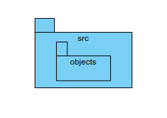
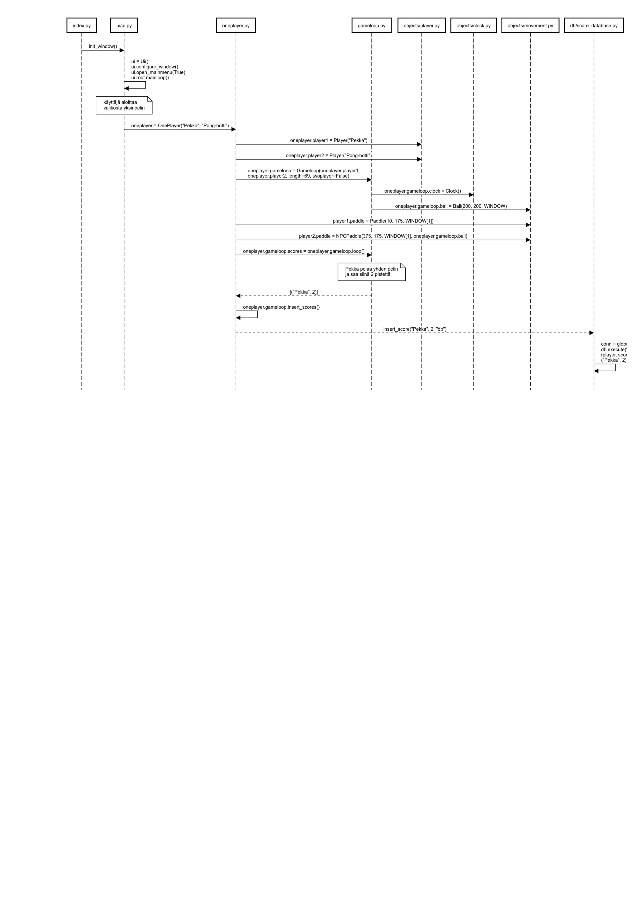
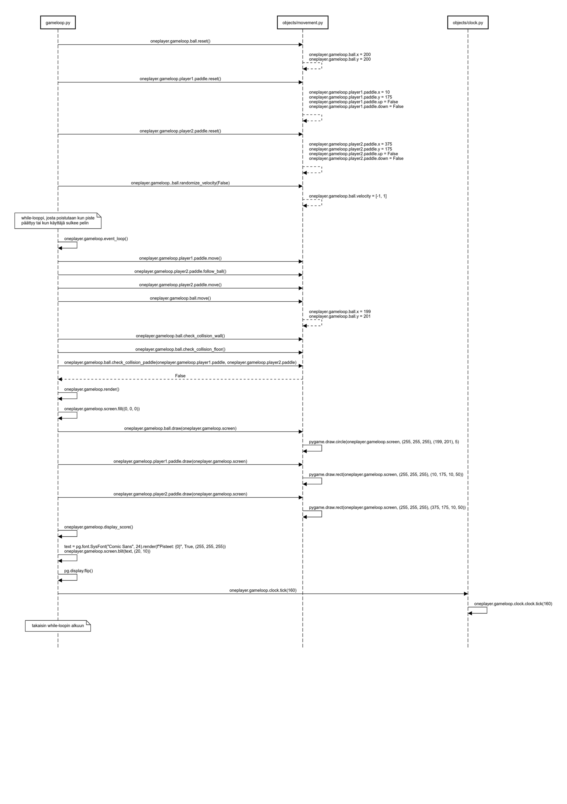

# Ohjelman arkkitehtuuri

### Luokkakaavio
Ohjelmassa on kokonaisuudessaan yhdeksän luokkaa. Luokka <strong>Ui</strong> vastaa käyttöliittymän toteutuksesta, luokat <strong>OnePlayer</strong> ja <strong>TwoPlayer</strong> pelin alustuksesta ja loput pelilogiikasta.

Sekä yksin- että kaksinpelissä käytetään samaa <strong>Gameloop</strong>-luokkaa, jonka takia se on hieman monimutkainen. <strong>Player</strong>-objektit ja Gameloop-luokka alustetaan pelityypistä riippuen src-hakemiston juuressa sijaitsevissa <strong>OnePlayer</strong>- ja <strong>TwoPlayer</strong> -luokissa, jonka jälkeen niissä kutsutaan Gameloop-luokan metodia <strong>loop()</strong>, joka aloittaa pelin. 

Player-olio saa attribuutikseen <strong>Paddle</strong>- tai <strong>NPCPaddle</strong>-olion vastaamaan mailan liikkeestä ja renderöinnistä.

Gameloop-olio saa attribuuteikseen <strong>Ball</strong>-olion, joka vastaa pallon liikkeestä ja renderöinnistä sekä <strong>Clock</strong>-olion, joka toimii pitkälti kuten pygame-kirjaston kello.

Ball- Paddle- sekä NPCPaddle-luokat sijaitsevat objects-hakemiston tiedostossa movement.py, muut luokat sijaitsevat omissa tiedostoissaan hakemistoissa ui ja src.

### Pakkauskaavio

Ohjelman käyttöliittymäkoodi sijaitsee ui-hakemistossa, tietokantakoodi db-hakemistossa ja pelilogiikkakoodi objects-hakemistossa.

### Käyttöliittymä

Käyttöliittymä sisältää viisi eri näkymää:

- Päävalikko, josta pääsee
  - yksinpelinäkymään
  - kaksinpelinäkymään
  - tulostaulunäkymään
 
  ja
  - ohjenäkymään

Jokaisesta näkymästä pääsee takaisin päävalikkoon.

### Pelin alustuksen sekvenssikaavio

Allaoleva sekvenssikaavio kuvaa ohjelman toimintaa "poetry run invoke start"-komennon kutsuhetkestä pelisilmukan alkuhetkeen ja pelisilmukan lopetushetkestä pisteiden tallennukseen. Pelisilmukan logiikkaa kuvataan tarkemmin seuraavassa kaaviossa. Poisrajaantuneessa insert_score()-funktiokutsussa oikeassa alareunassa lukee 

conn = globals()["db"]

db.execute("INSERT INTO Scores
(player, score) VALUES (?, ?)",
("Pekka", 2))

Funktion kolmas attribuutti db_name määrittää, tallennetaanko pisteet varsinaiseen tietokantaan "scores.db", jonka yhteys on tallennettu muuttujaan nimeltä db, vai testitietokantaan "test.db", jonka yhteys on tallennettu muuttujaan nimeltä test_db

### Pelilogiikan sekvenssikaavio

Allaoleva sekvenssikaavio kuvaa pelisilmukan toimintaa yhden iteraation ajan sen jälkeen kun käyttäjä on aloittanut valikosta yksinpelin ja OnePlayer-luokka on alustanut pelisilmukan ja kutsunut sen loop()-funktiota. Tämän silmukan iteraation aikana käyttäjä ei paina näppäintä liikuttaakseen mailaansa.

