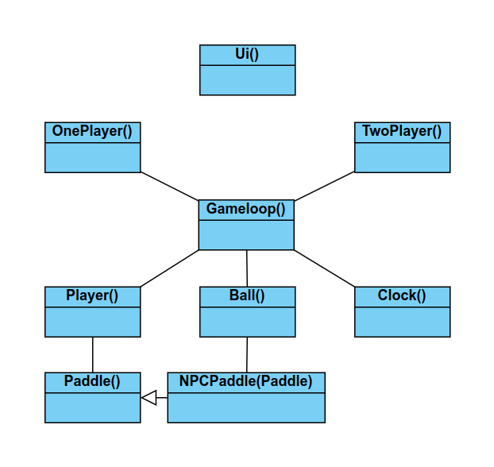

# Ohjelman arkkitehtuuri

Ohjelmassa on kokonaisuudessaan kuusi luokkaa, joista kaksinpelissä käytetään vain viittä (<strong>NPCPaddle</strong> jää pois). 

Sekä yksin- että kaksinpelissä käytetään samaa <strong>Gameloop</strong>-luokkaa, jonka takia se on valitettavan monimutkainen ja vaikeasti testattava. <strong>Player</strong>-objektit ja <strong>Gameloop</strong>-luokka alustetaan pelityypistä riippuen src-hakemiston juuressa olevissa oneplayer.py ja twoplayer.py -tiedostoissa, jonka jälkeen molemmissa tiedostoissa kutsutaan Gameloop-luokan metodia <strong>loop()</strong>, joka aloittaa pelin.
### Luokkakaavio

Tällä hetkellä ohjelman käyttöliittymä on kokonaan index.py -tiedostossa, mutta tarkoituksenani on jakaa se järkeviin osiin uuteen ui-hakemistoon, josta tulee objects-hakemiston rinnakkaishakemisto.
### Pakkauskaavio

