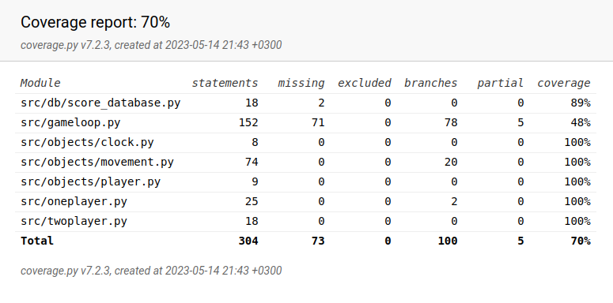

# Testausdokumentti

Ohjelman testaus on toteutettu unittesteillä. Automatisoidut testit kattavat kokonaan objects-hakemistossa sijaitsevat
Ball-, Paddle-, ja NPCPaddle-luokat ja 48-prosenttisesti niiden toiminnan pelisilmukan sisällä. 
Käyttöjärjestelmätestit on toteutettu täysin manuaalisesti eikä niitä ole huomioitu testikattavuudessa. 

Tietokantaa on testattu testititetokannalla. Tietokantatoimintojen testikattavuus on 89% ja ainoa testaamatta jäänyt
osa on tietokantojen luomisfunktio create_taable().

Ohjelman kokonaistestikattavuus on 70%. Testaamatta jääneitä pelilogiikan osia on testattu manuaalisesti. Tällaisia osia
ovat muun muassa pelisilmukan loop()- ja end()- funktiot, joiden testauksen automatisointi silmukoiden rakenteen takia ei
onnistunut järkevästi.

